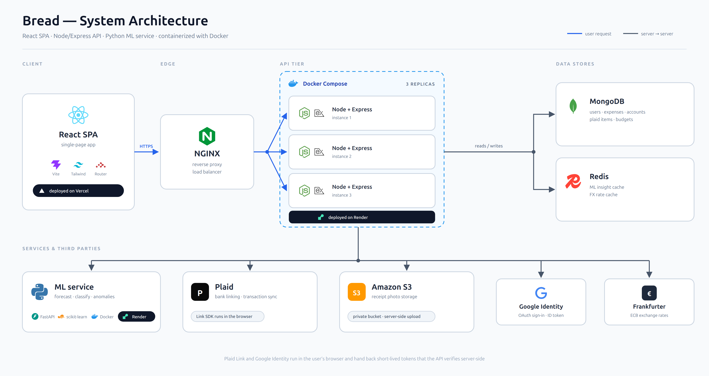

# 🍞 Bread

A personal finance app capable of connecting to real bank data, tracking spending across multiple accounts and currencies, running with three machine-learning models to forecast spending, classify purchases, and flag unusual charges.

Built as a full-stack system across three services, with load balancing, caching, containerization, and a public demo mode.

---

## 🎥 Demo video

<!-- in progress -->

*Coming soon.*

---

## 📑 Table of contents

- [Features](#-features)
- [Tech stack](#-tech-stack)
- [Architecture](#-architecture)
- [Running the project](#-running-the-project)
- [Environment variables](#-environment-variables)
- [Testing](#-testing)
- [CI/CD](#-cicd)
- [How it was built](#-how-it-was-built)
- [What I learned](#-what-i-learned)
- [Possible improvements](#-possible-improvements)

---

## ✨ Features

### 🏦 Accounts and transactions
- **Bank integration via Plaid** — link real bank and credit accounts, with automatic transaction import using cursor-based sync
- **Multi-account support** — checking and credit shown separately, since a credit balance is money owed rather than money held
- **Multi-currency** — every transaction stores its native currency and converts to your chosen base currency using the exchange rate *on the transaction date*, so historical totals stay stable
- **Manual entry** — add expenses or income by hand, using the same 16-category system as imported transactions
- **Bill splitting** — record only your real share of a group expense while keeping the original total visible
- **Receipt photos** — upload receipts to private S3 storage, viewable through short-lived signed links

### 🤖 Machine learning
- **Spend forecasting** — three quantile-regression models produce an interquartile range, the middle 50% of likely outcomes, rather than a single number, because one figure implies precision the data doesn't support
- **Category classification** — a pretrained TF-IDF + logistic regression model suggests a category from the merchant or note text, shown as chips
- **Anomaly detection** — flags charges that break the pattern for their category using median-based robust statistics, catching and accounting predictions from outliers
- **Recurring detection** — finds subscriptions by clustering transactions on merchant and amount, then checking whether the gaps between them are consistent enough to be a real schedule

### 📊 Insights
- Category breakdown donut with month-by-month navigation
- Month-over-month spending comparison
- Per-category budgets with a warning tier before you go over
- "Safe to spend" figure derived from remaining budget

### 🔐 Platform
- **JWT authentication** with bcrypt password hashing, plus **Google sign-in**
- **Public demo mode** — one click provisions a temporary seeded account, rate-limited and auto-cleaned after 24 hours
- **Admin dashboard** — aggregate platform stats behind an allowlist
- **Graceful degradation** — if the ML service is unavailable, insight cards say so and the rest of the app keeps working

---

## 🧰 Tech stack

| Layer | Technologies |
|---|---|
| **Frontend** | React 19, Vite, Tailwind CSS v4, React Router 7, Recharts, Axios |
| **Backend** | Node.js, Express 5, MongoDB (Mongoose 9), JWT, bcrypt, multer, ioredis |
| **ML service** | Python 3.14, FastAPI, scikit-learn, NumPy, pandas, joblib, uvicorn |
| **Infrastructure** | Docker, Docker Compose, Nginx, Redis, express-rate-limit |
| **Third-party** | Plaid, AWS S3, Google Identity Services, Frankfurter (ECB exchange rates) |
| **Testing** | Jest, supertest, mongodb-memory-server, pytest |
| **Deployment** | Vercel (frontend), Render (backend + ML service), MongoDB Atlas, Redis Cloud |

---

## 🏗️ Architecture

Three independently deployable services. The browser only ever calls the Node API; the API brokers everything else.



**A key design**
The ML service is stateless, purely acting as a calculator for the apps given features whenever called. Bread stays working even if the ML-service has an issue.

**Two flows bypass the API on the way out.**
Google Identity and Plaid Link run in the browser and hand back short-lived tokens. Google's is a signed JWT the backend verifies against Google's public keys; Plaid's is a `public_token` that only becomes usable after a server-side exchange. In both cases the credential that actually matters never reaches the browser.

---

## ▶️ Running the project

### Prerequisites

- Node.js 24+
- Python 3.14+
- MongoDB (local instance or an Atlas connection string)
- Docker (optional — only for the containerized stack)

### Option A — run services individually

**1. Backend** (port 4000)

```bash
cd backend
npm install
# create .env and fill in the values listed below
npm run dev
```

**2. ML service** (port 8000)

```bash
cd ml-service
python3 -m venv .venv
.venv/bin/pip install -r requirements.txt
.venv/bin/uvicorn app.main:app --reload --port 8000
```

**3. Frontend** (port 5173)

```bash
cd frontend
npm install
npm run dev
```

Then open `http://localhost:5173`. The Vite dev server proxies `/api` to the backend, so both run on the same origin.

> 💡 The backend runs fine without the ML service — insight cards simply show as unavailable.

### Option B — Docker Compose

```bash
docker compose up --build
```

Starts MongoDB, Redis, the ML service, three backend replicas, and Nginx. The app is served at `http://localhost:8080`, with Nginx load-balancing `/api` across the backend instances.

> ⚠️ Compose publishes ports `8080` and `27017`. If you already have a local MongoDB container or backend running, stop them first to avoid a collision.

---

## 🔑 Environment variables

### `backend/.env`

| Variable | Required | Purpose |
|---|---|---|
| `MONGO_URI` | Yes | MongoDB connection string |
| `JWT_SECRET` | Yes | Secret for signing auth tokens |
| `PORT` | No | Defaults to 4000 |
| `PLAID_CLIENT_ID` | Yes | Plaid credentials |
| `PLAID_SECRET` | Yes | Plaid credentials |
| `PLAID_ENV` | Yes | `sandbox`, `development`, or `production` |
| `ML_SERVICE_URL` | Yes | e.g. `http://localhost:8000` |
| `REDIS_URL` | No | Caching is skipped entirely if unset |
| `AWS_REGION` | For receipts | S3 bucket region |
| `AWS_ACCESS_KEY_ID` | For receipts | Read by the AWS SDK credential chain |
| `AWS_SECRET_ACCESS_KEY` | For receipts | Read by the AWS SDK credential chain |
| `S3_BUCKET` | For receipts | Bucket name |
| `GOOGLE_CLIENT_ID` | For Google sign-in | Verifies the ID token audience |
| `ADMIN_EMAILS` | No | Comma-separated allowlist; nobody is admin if unset |
| `FRONTEND_ORIGIN` | No | Comma-separated CORS origins for split-origin deploys |
| `ML_INSIGHT_TIMEOUT_MS` | No | Defaults to 40000 |
| `TRUST_PROXY_HOPS` | No | Defaults to 1 |
| `AUTH_RATELIMIT_MAX`, `API_RATELIMIT_MAX`, `DEMO_RATELIMIT_MAX` | No | Override the default rate limits |

### `frontend/.env`

| Variable | Required | Purpose |
|---|---|---|
| `VITE_GOOGLE_CLIENT_ID` | For Google sign-in | The Google button doesn't render without it |
| `VITE_API_URL` | No | Defaults to `/api` (same-origin) |

> ⚠️ `VITE_*` variables are baked in at build time. Changing one requires a rebuild, not just a restart.

### Third-party setup

- **Plaid** — create an account and use Sandbox credentials. The test login is `user_good` / `pass_good`.
- **AWS S3** — create a private bucket with all Block Public Access settings enabled, and an IAM user granted only `GetObject`, `PutObject`, and `DeleteObject` on that bucket.
- **Google sign-in** — create an OAuth 2.0 Web client and add your frontend origins (e.g. `http://localhost:5173`) under *Authorized JavaScript origins*. Leave redirect URIs empty and ignore the client secret — this uses the ID-token flow, which needs neither.

---

## 🧪 Testing

```bash
cd backend && npm test               # 198 tests across 18 suites
cd ml-service && .venv/bin/pytest    # 37 tests
```

Backend tests run against an in-memory MongoDB instance, and every third-party service (Plaid, S3, Redis, Google, the ML service) is mocked — so the suite never makes a network call or touches real infrastructure.

---

## 🔄 CI/CD

The frontend deploys to Vercel and the API and ML service deploy to Render, each building from the default branch.

**Keeping the ML service awake** — `.github/workflows/keep-ml-warm.yml`

Free-tier hosting puts a service to sleep once it has been idle for around fifteen minutes, and waking it back up takes roughly half a minute. A scheduled GitHub Actions job pings the ML service every ten minutes between 8 AM and 12 PM, so during those hours it is already running when someone opens the app.

A few details worth knowing if you fork this:

- GitHub cron only speaks UTC and knows nothing about daylight saving, so a fixed schedule would drift by an hour twice a year. The schedule instead covers both EDT and EST, and the job checks the real local time and exits early when it falls outside the window.
- Ten-minute spacing is deliberate. It has to be shorter than the fifteen-minute idle timeout, and the gap leaves room for GitHub's scheduler running late.
- The URL comes from a repository variable `ML_SERVICE_URL`, falling back to the deployed URL, so moving the service doesn't mean editing the workflow.
- The first ping of the day is slow by design, so a single failure retries after 30 seconds before the run is marked failed.

The workflow can also be triggered by hand from the Actions tab.

---

## 🔨 How it was built

The project was built in phases, each ending in something demoable before the next began: authentication and manual entry, then Plaid integration and multi-currency, then the ML service, then insight features, then storage and access control, then containerization, then system-design work like load balancing and caching, and finally a design pass.

Developed on a test-based mindset, wrote failing tests, confirm the reason it fails is correct, and then implement the feature. This catches bugs that a test that was written after implementing might miss.

Any feature deployed was thoroughly double checked even after successful automated tests. Load balancing was confirmed by manually checking server ID's rotate across replicas, and shared caching was confirmed by tracking the network headers of API requests, watching whether repeated requests on different replicas were a cache miss or hit for all. S3 permissions were also confirmed by ensuring the deleted object returns a specific error code, 403, which means that the S3 bucket and IAM policy and user have been set up correctly.

Throughout the project I used AI assistance to help teach me foreign concepts and services, debugging, draft designs, and break down architectural trade-offs.

---

## 💡 What I learned

**⏱️ Timeouts need to fit the job**

Insight cards showed "unavailable" while the ML service was fine. The 3-second timeout came from my laptop, where the service answered in 20ms. In production the endpoint retrains three models per call, taking 2.6 to 4.6 seconds. It also got slower with more user history, so new accounts worked and old ones broke. A short timeout looks just like an outage.

**🔌 Don't count on someone else's API to fix itself**
Transactions imported as "Other" because Plaid fills in categories later. I assumed the next sync would clean them up. It didn't. Plaid sent events for only a few and filled in the rest silently, so an event-driven sync could never catch those rows. Grouping by merchant name while debugging had hidden the real count.

**🔒 Check ownership inside the query**
Every query filters by user ID up front, rather than fetching a record and then checking who owns it. Ask for someone else's data and nothing matches, so you get a 404. You also can't tell if the record exists.

**⚡ One await at a time adds up**
Currency conversion awaited once per transaction. The cache sits on another machine, so even a hit cost a network trip, one per transaction instead of one per date. Batching took it from 250ms to under 50ms.

---

## 🚀 Possible improvements

**📈 Scaling**
- The app is capable of extending to more than just one replica, however free-tier deployment has limitations, given real resources the app is capable of horizontal scaling.
- Spend forecasting refits three models on every request. Caching absorbs most of this, but a cheaper model or scheduled precomputation would remove the cost entirely.

**🛡️ Security hardening**
- Deleted receipts are removed on a best-effort basis, so a failed delete leaves an unreferenced object in the bucket. An S3 lifecycle rule would close that gap.

**🧩 Features**
- Plaid webhooks for background freshness. The app currently re-syncs on every dashboard load, so data can't be stale from the user's perspective, but webhooks would cut redundant syncing.
- Surface investment and loan account types, which are imported but not yet displayed.

---

## 📄 License

This project was built for portfolio and educational purposes.
